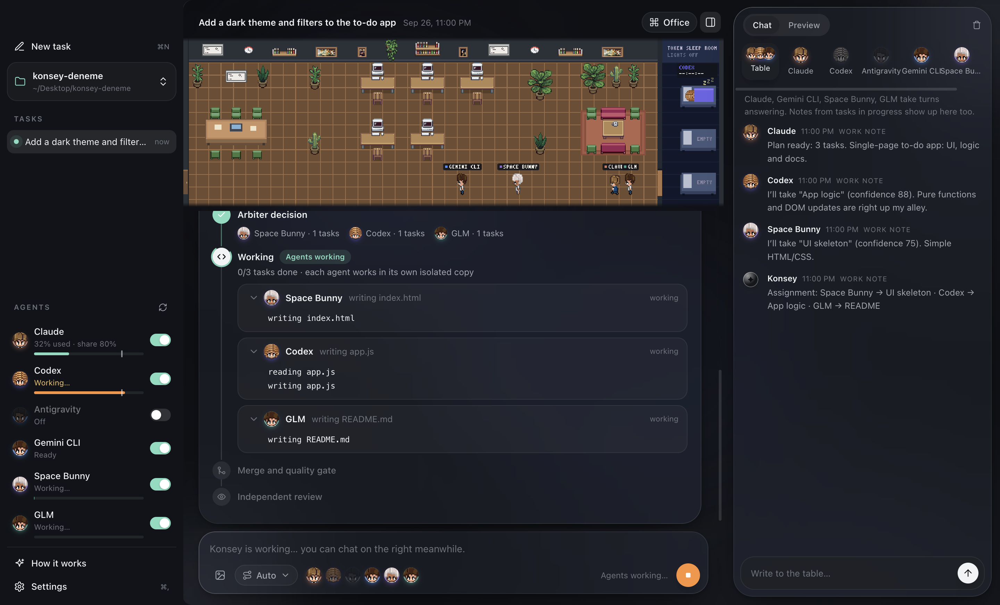

🇹🇷 Türkçe: [README.tr.md](README.tr.md)


# Konsey

Konsey ("council" in Turkish) is a desktop app that makes several AI coding agents work
together on one project folder. You write one request; Konsey plans it, splits it into
tasks, and hands each task to the cheapest agent that can do it. Every agent works in its
own isolated git worktree so they never collide; results are merged, tested, reviewed by
another agent, and — if everything passes — applied to your folder.

[Download](https://github.com/ardakie/konsey/releases/latest) · [Releases](https://github.com/ardakie/konsey/releases)



## Features

- **Parallel, isolated agents** — each agent works in its own git worktree copy, so no two agents ever overwrite each other's changes.
- **Cost-aware routing** — Konsey sends each task to the cheapest agent that can handle it, saving premium calls for the work that needs them.
- **Usage caps** — cap each agent at a share of your own plan limit, e.g. "use at most 40% of my Claude limit."
- **Council chat** — talk to one agent one-on-one, or ask the whole council at once, at a shared council table. Chat is read-only — it never writes files.
- **Integrations** — connect GitHub, Supabase, Sentry, Stripe, PostHog, Notion or any remote MCP server once (Settings → Integrations). Claude and Codex can then use those services while they work, e.g. "check the latest Sentry errors and fix them". Tokens stay in the OS secure storage; GitHub and Supabase connect read-only by default.
- **Pixel office** — a live pixel-art office shows which agent is working, reviewing, or resting, in real time.
- **Local & private** — no Konsey servers; everything runs on your machine, using your own subscriptions and API keys.

## Supported agents

| Agent | How Konsey talks to it |
|---|---|
| Claude Code | `claude` CLI |
| OpenAI Codex CLI | `codex` CLI |
| Google Antigravity | Antigravity's local agent server — **macOS only** |
| Gemini CLI, Cursor Agent, GitHub Copilot CLI, OpenCode, Qwen Code, Amp, Factory Droid, Crush, Goose, Aider | auto-detected coding CLIs |
| Custom CLI | any command-line agent you point Konsey at |
| OpenAI-compatible API providers | OpenRouter, DeepSeek, GLM, or your own endpoint, with your own key |

Konsey has a "Connect agents" screen that can install a supported CLI and open its sign-in
in a terminal with one click.

## Install

### macOS

1. Download the DMG for your Mac — [Apple Silicon](https://github.com/ardakie/konsey/releases/latest/download/Konsey-mac-arm64.dmg) or [Intel](https://github.com/ardakie/konsey/releases/latest/download/Konsey-mac-x64.dmg).
2. Open it and drag Konsey to Applications.
3. **Konsey isn't notarized by Apple**, so the first launch is blocked. Fix it in System
   Settings → Privacy & Security → scroll down → "Open Anyway" (or right-click the app → Open).

Alternative one-line install that skips the warning entirely (downloads the zip with
`curl`, which doesn't add the quarantine flag that Gatekeeper checks):

```bash
curl -fsSL https://raw.githubusercontent.com/ardakie/konsey/main/scripts/install.sh | bash
```

### Windows

1. Download the [setup .exe](https://github.com/ardakie/konsey/releases/latest/download/Konsey-windows-x64-setup.exe).
2. Run it — it installs per-user (no admin rights needed) and launches automatically.
3. **The installer isn't code-signed**, so Windows SmartScreen may say "Windows protected
   your PC". Click "More info" → "Run anyway".

### Requirements

- macOS 11+ (Apple Silicon or Intel) or Windows 10/11 x64
- git — macOS: `xcode-select --install`; Windows: [Git for Windows](https://git-scm.com)
- At least one coding agent CLI
- Many agent CLIs also need [Node.js 20+](https://nodejs.org)

## First steps

Open Konsey → "How it works" / "Connect agents" → install or sign in to at least one
agent → pick a project folder → write a task.

## How it works

1. **Plan** — an agent breaks your request into independent tasks and marks the files each one touches.
2. **Claim** — the task list is offered to the agents suited to that work.
3. **Isolated worktrees** — each agent runs in its own git worktree, so nothing collides.
4. **Merge** — every agent's branch is combined into a single integration branch.
5. **Validate** — the project's test/typecheck/build/lint commands run against the integration branch.
6. **Review** — an independent agent checks the merged result. If something's wrong, one repair pass runs and validation repeats.
7. **Apply** — once it passes, the result is applied to your project folder.

## Privacy & safety

- Agents run through their official CLIs with their normal permission modes: read-only
  while planning or reviewing, and file edits scoped only to the task's own worktree.
- Council chat is read-only — it never writes files.
- API keys are stored in your OS's secure storage (macOS Keychain / Windows encrypted
  storage), never in a plain-text config file.
- No telemetry. Konsey has no servers; your code only goes to the AI services you connect it to.

## Development

```bash
npm install
npm start           # run from source
npm test            # unit tests
npm run verify       # typecheck + test + build
npm run package:mac  # build the macOS app
npm run package:win  # build the Windows app
```

Releasing: push a tag `vX.Y.Z` and GitHub Actions builds macOS and Windows and publishes
the release.

### Website

The download site lives in a separate repository and is published with Cloudflare Pages.

## Data locations

| Path | Contents |
|---|---|
| `~/.konsey/config.json` | Provider definitions, agent profiles, recent projects. No secrets. |
| `~/.konsey/runs/` | Task run history. |
| `~/.konsey/chats/` | Council and one-on-one chat history. |
| Secrets | macOS: Keychain (`konsey-provider` service). Windows/Linux: `~/.konsey/secrets.json`, encrypted with Electron `safeStorage` (DPAPI on Windows). |

## License

MIT.

## Credits

Pixel art office assets are from [pixel-agents](https://github.com/pixel-agents-hq/pixel-agents)
by Pablo De Lucca (MIT).
