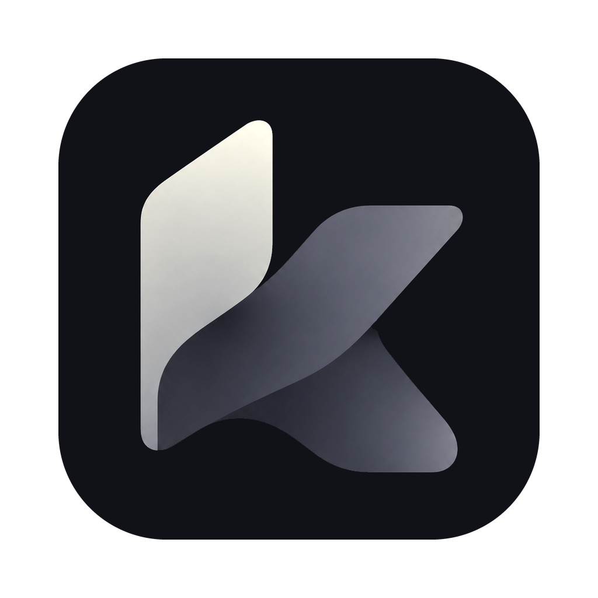
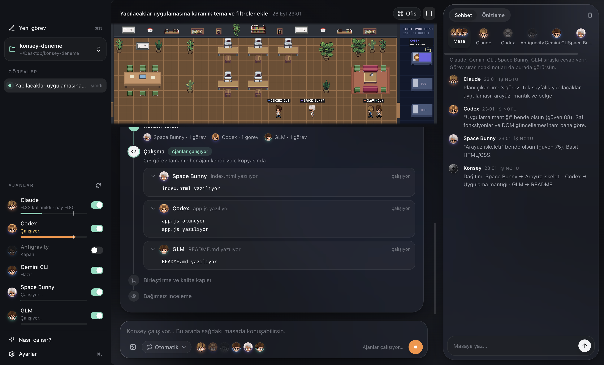

🇬🇧 English: [README.md](README.md)



# Konsey

Konsey, birden fazla yapay zeka kodlama ajanını aynı proje klasöründe birlikte
çalıştıran bir masaüstü uygulaması. Tek bir istek yazarsınız; Konsey bunu planlar,
görevlere böler ve her görevi yapabilecek en ucuz ajana verir. Her ajan kendi izole
git worktree'sinde çalışır, böylece hiçbiri birbirine karışmaz; sonuçlar birleştirilir,
test edilir, başka bir ajan tarafından incelenir ve her şey geçerse klasörünüze uygulanır.

[İndir](https://ardakie.github.io/konsey/) · [Sürümler](https://github.com/ardakie/konsey/releases)



## Özellikler

- **Paralel, izole ajanlar** — her ajan kendi git worktree kopyasında çalışır, bu yüzden hiçbiri diğerinin değişikliğinin üstüne yazmaz.
- **Maliyete duyarlı yönlendirme** — Konsey her görevi yapabilecek en ucuz ajana gönderir, pahalı ajanları gerçekten gerektiği işe saklar.
- **Kullanım limitleri** — her ajanı kendi abonelik limitinizin bir payıyla sınırlayın, örneğin "Claude limitimin en fazla yüzde 40'ını kullan."
- **Konsey masası** — bir ajanla birebir ya da tüm konseyle aynı anda, ortak bir masada konuşun. Sohbet salt okunurdur — dosya yazmaz.
- **Entegrasyonlar** — GitHub, Supabase, Sentry, Stripe, PostHog, Notion ya da herhangi bir uzak MCP sunucusunu bir kez bağlayın (Ayarlar → Entegrasyonlar). Claude ve Codex çalışırken bu servisleri kullanabilir, örneğin "Sentry'deki son hataları incele ve düzelt". Token'lar sistemin güvenli deposunda kalır; GitHub ve Supabase varsayılan olarak salt okunur bağlanır.
- **Piksel ofis** — canlı bir piksel-art ofis, hangi ajanın çalıştığını, incelediğini ya da dinlendiğini gerçek zamanlı gösterir.
- **Yerel ve özel** — Konseyin sunucusu yoktur; her şey kendi makinenizde, kendi aboneliklerinizle ve API anahtarlarınızla çalışır.

## Desteklenen ajanlar

| Ajan | Konsey nasıl konuşur |
|---|---|
| Claude Code | `claude` CLI |
| OpenAI Codex CLI | `codex` CLI |
| Google Antigravity | Antigravity'nin yerel ajan sunucusu — **yalnızca macOS** |
| Gemini CLI, Cursor Agent, GitHub Copilot CLI, OpenCode, Qwen Code, Amp, Factory Droid, Crush, Goose, Aider | otomatik algılanan kodlama CLI'ları |
| Özel CLI | işaret ettiğiniz herhangi bir komut satırı ajanı |
| OpenAI-uyumlu API sağlayıcıları | OpenRouter, DeepSeek, GLM ya da kendi uç noktanız, kendi anahtarınızla |

Konseyin "Ajan bağla" ekranı desteklenen bir CLI'ı kurabilir ve girişini tek tıkla
bir terminalde açabilir.

## Kurulum

### macOS

1. Mac'iniz için DMG dosyasını indirin — [Apple Silicon](https://github.com/ardakie/konsey/releases/latest/download/Konsey-mac-arm64.dmg) ya da [Intel](https://github.com/ardakie/konsey/releases/latest/download/Konsey-mac-x64.dmg).
2. Açın ve Konsey'i Applications klasörüne sürükleyin.
3. **Konsey Apple tarafından noter onaylı değildir**, bu yüzden ilk açılış engellenir.
   Çözüm: Sistem Ayarları → Gizlilik ve Güvenlik → aşağı kaydırın → "Yine de Aç"
   (ya da uygulamaya sağ tıklayıp Aç).

Uyarıyı tamamen atlayan tek satırlık alternatif kurulum (zip'i `curl` ile indirir,
Gatekeeper'ın kontrol ettiği karantina bayrağını eklemez):

```bash
curl -fsSL https://raw.githubusercontent.com/ardakie/konsey/main/site/install.sh | bash
```

### Windows

1. [Kurulum .exe dosyasını](https://github.com/ardakie/konsey/releases/latest/download/Konsey-windows-x64-setup.exe) indirin.
2. Çalıştırın — kullanıcı bazında kurulur (yönetici hakkı gerekmez) ve otomatik açılır.
3. **Kurulum dosyası imzalı değildir**, bu yüzden Windows SmartScreen "Windows
   bilgisayarınızı korudu" diyebilir. "Daha fazla bilgi" → "Yine de çalıştır"ı tıklayın.

### Gereksinimler

- macOS 11+ (Apple Silicon ya da Intel) veya Windows 10/11 x64
- git — macOS: `xcode-select --install`; Windows: [Git for Windows](https://git-scm.com)
- En az bir kodlama ajanı CLI'ı
- Birçok ajan CLI'ı ayrıca [Node.js 20+](https://nodejs.org) ister

## İlk adımlar

Konsey'i açın → "Nasıl çalışır" / "Ajan bağla" → en az bir ajanı kurun ya da giriş
yapın → bir proje klasörü seçin → bir görev yazın.

## Nasıl çalışıyor

1. **Plan** — bir ajan isteğinizi bağımsız görevlere böler ve her görevin dokunacağı dosyaları işaretler.
2. **Paylaşım** — görev listesi o işe uygun ajanlara sunulur.
3. **İzole worktree'ler** — her ajan kendi git worktree'sinde çalışır, böylece hiçbiri çakışmaz.
4. **Birleştirme** — her ajanın dalı tek bir entegrasyon dalında birleştirilir.
5. **Doğrulama** — entegrasyon dalında projenin test/typecheck/build/lint komutları çalıştırılır.
6. **İnceleme** — bağımsız bir ajan birleşik sonucu denetler. Bir sorun varsa tek bir onarım turu yapılır ve doğrulama tekrarlanır.
7. **Uygulama** — sonuç geçtiğinde proje klasörünüze uygulanır.

## Gizlilik ve güvenlik

- Ajanlar kendi resmi CLI'ları üzerinden, kendi normal izin modlarıyla çalışır: plan
  ve inceleme turlarında salt okunur, dosya değişiklikleri yalnızca görevin kendi
  worktree'siyle sınırlı.
- Konsey masası salt okunurdur — dosya yazmaz.
- API anahtarları işletim sisteminizin güvenli deposunda tutulur (macOS Keychain /
  Windows şifreli depolama), asla düz metin bir ayar dosyasına yazılmaz.
- Telemetri yoktur. Konseyin sunucusu yoktur; kodunuz yalnızca bağladığınız yapay
  zeka servislerine gider.

## Geliştirme

```bash
npm install
npm start           # kaynaktan çalıştır
npm test            # birim testleri
npm run verify       # typecheck + test + build
npm run package:mac  # macOS uygulamasını derle
npm run package:win  # Windows uygulamasını derle
```

Sürüm yayınlama: `vX.Y.Z` etiketini gönderin; GitHub Actions macOS ve Windows için
derleyip sürümü yayınlar.

### Web sitesi

İndirme sitesi düz bir klasördür: `site/`. **Cloudflare Pages**'te yayınlamak için bu depoyu bağlayın ve
*Framework preset:* None, *Build command:* (boş), *Build output directory:* `site` seçin. Site ayrıca `.github/workflows/pages.yml` ile GitHub Pages'e de yüklenir.

## Veri konumları

| Yol | İçerik |
|---|---|
| `~/.konsey/config.json` | Sağlayıcı tanımları, ajan profilleri, son projeler. Anahtar içermez. |
| `~/.konsey/runs/` | Görev çalışma geçmişi. |
| `~/.konsey/chats/` | Konsey masası ve birebir sohbet geçmişi. |
| Anahtarlar | macOS: Keychain (`konsey-provider` servisi). Windows/Linux: `~/.konsey/secrets.json`, Electron `safeStorage` ile şifrelenir (Windows'ta DPAPI). |

## Lisans

MIT.

## Katkılar

Piksel-art ofis görselleri Pablo De Lucca'nın
[pixel-agents](https://github.com/pixel-agents-hq/pixel-agents) projesinden alınmıştır (MIT).
